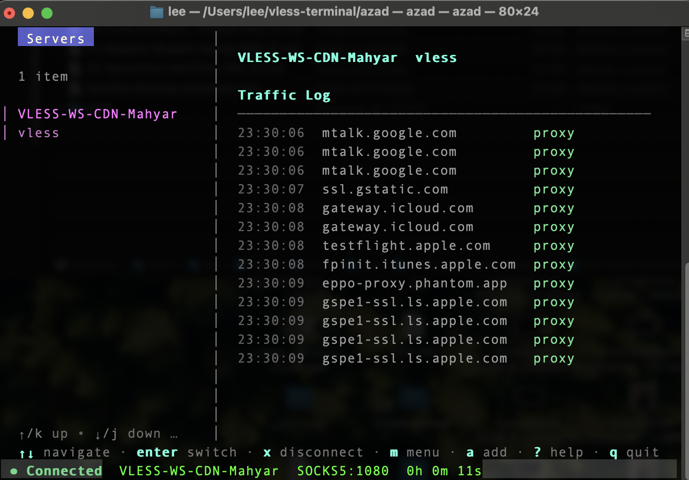

<p align="center">
  <h1 align="center">Azad</h1>
  <p align="center">Beautiful terminal VPN client — one command to connect to the fastest server</p>
</p>

<p align="center">
  <a href="https://github.com/leejooy96/azad/releases/latest"></a>
  <a href="https://github.com/leejooy96/azad/blob/master/LICENSE"></a>
  
  
</p>

<p align="center">
  
</p>

---

Azad is a keyboard-driven terminal VPN client that wraps [Xray-core](https://github.com/XTLS/Xray-core) as a Go library into a single binary. It provides a stunning [Bubble Tea](https://github.com/charmbracelet/bubbletea) TUI with vim-style navigation, concurrent server pinging, live traffic logs, a firewall-based kill switch, and split tunneling — all from your terminal.

## Features

- **Multi-protocol** — VLESS, VMess, Trojan, Shadowsocks with full transport/TLS/REALITY support
- **Stunning TUI** — split-pane layout, vim-style keys, fuzzy search, real-time traffic log
- **Kill switch** — firewall-based (macOS `pf`) zero-leak traffic blocking
- **Split tunneling** — inclusive/exclusive modes with IPs, CIDRs, domains, and wildcards
- **Concurrent ping** — test all servers at once, auto-sort by latency
- **Subscriptions** — add subscription URLs with one-key refresh
- **Quick connect** — auto-selects fastest or last-used server
- **System proxy** — auto-configures macOS SOCKS5/HTTP system proxy
- **Single binary** — Xray-core embedded as Go library, zero external dependencies
- **Auto geo assets** — downloads `geoip.dat` / `geosite.dat` on first run with SHA256 verification
- **Cross-platform** — macOS and Linux (amd64 + arm64)
- **Shell completions** — bash, zsh, and fish

## Quick Start

```bash
# Install
curl -sSL https://github.com/leejooy96/azad/releases/latest/download/install.sh | sh

# Launch
azad
```

Then press `a` to add a server URI or `s` to add a subscription URL.

## Installation

### Homebrew (macOS / Linux)

```bash
brew tap leejooy96/tap
brew install azad
```

### Debian / Ubuntu

```bash
# Download the .deb from the latest release
sudo dpkg -i azad_*_amd64.deb
```

### Fedora / RHEL

```bash
# Download the .rpm from the latest release
sudo rpm -i azad_*_amd64.rpm
```

### Arch Linux (AUR)

```bash
yay -S azad-bin
```

### Snap

```bash
snap install azad --classic
```

### Build from Source

```bash
git clone https://github.com/leejooy96/azad.git
cd azad
go build -ldflags="-s -w" ./cmd/azad
./azad
```

Requires Go 1.25+.

## Usage

### TUI (default)

```bash
azad                    # Launch the interactive TUI
```

### CLI Quick Connect

```bash
azad connect                       # Connect to fastest/last-used server
azad connect "server name"         # Connect by name
azad connect --kill-switch         # Connect with kill switch enabled
```

### Split Tunnel Management

```bash
azad split-tunnel add 192.168.0.0/24     # Bypass VPN for local network
azad split-tunnel add "*.example.com"    # Bypass VPN for domain
azad split-tunnel mode exclusive         # Bypass listed, proxy the rest
azad split-tunnel mode inclusive         # Proxy listed, bypass the rest
azad split-tunnel enable
azad split-tunnel list
azad split-tunnel remove 192.168.0.0/24
azad split-tunnel clear
```

### Recovery

```bash
azad --cleanup          # Remove dirty state from a crash (restores internet)
azad --reset-terminal   # Restore terminal if display is corrupted
```

## Keyboard Shortcuts

### Navigation

| Key | Action |
|-----|--------|
| `j` / `k` or `Up` / `Down` | Navigate server list |
| `Enter` or `c` | Connect to selected server |
| `x` | Disconnect |
| `/` | Filter / search servers |
| `Esc` | Back / clear filter |
| `?` | Show full help |
| `q` or `Ctrl+C` | Quit |

### Server Management

| Key | Action |
|-----|--------|
| `a` | Add server from URI |
| `s` | Add subscription URL |
| `r` | Refresh all subscriptions |
| `p` | Ping all servers |
| `d` | Delete selected server |
| `D` | Clear all servers |

### Features

| Key | Action |
|-----|--------|
| `m` | Open menu (kill switch, split tunnel) |
| `Enter` / `Space` | Toggle kill switch (in menu) |
| `t` | Open split tunnel settings (in menu) |

## Supported Protocols

| Protocol | URI Format |
|----------|-----------|
| VLESS | `vless://uuid@host:port?type=tcp&security=tls&sni=...#name` |
| VMess | `vmess://base64-json` |
| Trojan | `trojan://password@host:port?security=tls&sni=...#name` |
| Shadowsocks | `ss://method:password@host:port#name` |

All protocols support TCP, WebSocket, gRPC, and HTTPUpgrade transports. TLS and REALITY security are fully supported.

## Configuration

Config is stored at `~/.config/azad/config.yaml` (XDG-compliant):

```yaml
proxy:
  socks_port: 1080     # SOCKS5 proxy port
  http_port: 8080      # HTTP proxy port
server:
  last_used: ""        # Auto-populated after connecting
split_tunnel:
  enabled: false
  mode: exclusive      # exclusive | inclusive
  rules: []
```

Server data is stored separately in `~/.local/share/azad/servers.json`.

## Kill Switch

The kill switch uses macOS packet filter (`pf`) to block **all** non-VPN traffic when enabled. This provides zero-leak protection if the VPN connection drops.

- Toggle via the menu (`m` key) in the TUI or `--kill-switch` flag in CLI mode
- Persists across terminal close and crashes
- Recover with `azad --cleanup` if internet is blocked after a crash
- Coordinates with split tunnel rules to allow bypass IPs through the firewall

## Split Tunneling

Control which traffic goes through the VPN:

- **Exclusive mode** (default) — listed rules bypass the VPN, everything else is proxied
- **Inclusive mode** — listed rules use the VPN, everything else goes direct

Supports single IPs, CIDR ranges (`10.0.0.0/8`), domains (`example.com`), and wildcard domains (`*.example.com`). Manage rules in the TUI or via `azad split-tunnel` CLI commands.

## Architecture

```
cmd/azad/           Entry point, version injection, signal handling
internal/
  cli/              Cobra command routing (root, connect, split-tunnel)
  config/           YAML config with koanf (XDG paths)
  engine/           Xray-core proxy lifecycle (start/stop, traffic logging)
  geoasset/         Auto-download geoip.dat/geosite.dat with SHA256
  killswitch/       macOS pf anchor rules
  lifecycle/        Signal handling, crash recovery, state management
  protocol/         URI parsers (VLESS, VMess, Trojan, Shadowsocks)
  serverstore/      Atomic JSON server persistence
  splittunnel/      Rule parsing, Xray routing rule generation
  subscription/     Subscription URL fetching and base64 decoding
  sysproxy/         macOS system proxy configuration
  tui/              Bubble Tea TUI (split-pane, modals, live log)
```

## License

[MIT](LICENSE)
